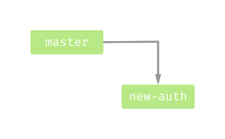
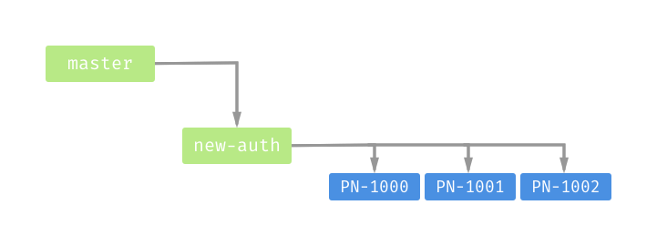

## Workflow по работе с Git

При разработке есть три основных потребности:
1. Новые фичи
1. Хотфиксы
1. Рефакторинг

### Разработка крупной фичи
#### Что такое крупная фича?
Крупная фича — это блок работы, который нужно катить в прод одновременно.  
Крупная фича декомпозируется на более мелкие задачи, которые могут выполняться разными людьми.  
Примеры крупных фич: новая страница, форма регистрации или ряд изменений на нескольких страницах, имеющих один продуктовый контекст.  

#### Порядок работы над крупной фичей
* Создаётся ветка с говорящим названием, например, `new-auth-page`.  
  С ней очень часто придётся работать, название должно быть запоминающимся.  
  [Не нужно использовать ветку `develop`](#why-you-should-not-use-develop-branch), потому что одновременно можно разрабатывать несколько независимых фич.  
  

* Крупная фича делится на более мелкие, которые оформляются как Pull Requests в фича-ветку.
  

  Основная часть работы — работа над такими небольшими тасками:
  1. Под каждый таск бранчимся от фича-ветки
    ```
    $ git checkout -b PN-1234
    ```
    _Подсказка: Флаг `-b` (branch) означает, что нужно **создать** новую ветку и перейти в неё._

    Если вы используете систему тикетов, где у задач есть номера, название ветки должно совпадать с номером задачи.
    Это поможет найти ветку, если пришлось передать задачу от одного разработчика другому,
    поможет удалить старые ветки.
    Плюс, возможно, будут какие-то профиты от интеграции системы тикетов и репозитория.
    Если же у задач номеров нет, используйте говорящие названия.
    Неправильно: `fix`
    Правильно: `fix-email-validation`

  1. Пишем код;
  1. Коммитим согласно [соглашению по именованию](./Convention.md);

  1. Перед созданием Pull Request для своей задачи, следует отребейзиться от фича-ветки:
    ```
    $ git fetch
    $ git rebase origin/feature-branch
    ```
    Если возникли конфликты, нужно поправить их и продолжить ребейз командой `git rebase --continue`.
  1. Создаём Pull Request в фича-ветку;
  1. Когда Pull Request смёрджен, ветка удаляется;

* Когда все мелкие фичи замерджены, крупная фича тестируется в своей ветке и отправляется в прод.
* Если всё ок, [ветка мерджится в `master`](#why-you-should-send-feature-to-production-before-merge).

### Хотфиксы и небольшие фичи
Для хотфиксов и небольших фич заводится отдельная ветка от `master`, название ветки должно совпадать с номером задачи:

```
$ git checkout -b PN-1234
```
_Подсказка: Флаг `-b` (branch) означает, что нужно **создать** новую ветку и перейти в неё._

После этого в ветке пишется и коммитится код, согласно [соглашению по именованию](./Convention.md):

```
$ git commit -m 'fix(scope): subject'
```

Ветка пушится и создаётся Pull Request в `master`:

```
$ git push -u origin PN-1234
```
_Подсказка: Флаг `-u` или `--set-upstream` означает, что нужно связать локальную и remote ветку._
Тогда в следующий раз не нужно будет писать remote и название ветки при `git push` и `git pull`.  
_Подсказка: Если вы хотите создавать Pull Requests из консоли, воспользуйтесь [утилитой hub от команды GitHub](https://github.com/github/hub/) и командой `hub pull-request`_

Код отправляется в прод. Если на проде всё ок, [ветка подмердживается в `master`](#why-you-should-send-feature-to-production-before-merge).

### Рефакторинг

Рефакторинг нужно делать от ветки `master` и как можно быстрее вливать в неё.
Часто рефакторинг застрагивает много кода, если затянуть мердж в основную ветку,
может быть много конфликтов. По этой же причине не нужно делать рефакторинг
в фича-ветках.
Если нужно что-то отрефакторить, чтобы написать новую функциональность, не ленитесь,
создайте отдельную ветку под рефакторинг и сделайте Pull Request в `master`.

---

<h3 id="why-you-should-send-feature-to-production-before-merge">
  Почему нужно сначала отправлять фичу в прод, а потом мерджить?
</h3>
Это нужно, чтобы можно было в любой момент безболезненно откатиться.
Если окажется, что вместе с последней фичей выкатился критичный баг, раскатывается версия из `master`.
`master` всегда остаётся стабильным, нельзя получить нестабильный код, ответвившись от `master`

<h3 id="why-you-should-not-use-develop-branch">
  Почему не нужно использовать ветку develop
</h3>
Основная проблема ветки `develop` — никогда не очевидно, что там должно быть, чего не должно и что там сейчас.
Если в `develop` идёт разработка новой крупной фичи, мы не можем разрабатывать две фичи, не меняя процесс.
Если там же делается рефакторинг, он пропадёт, если разработку фичи приходится отложить в пользу других.
В `develop` может попасть любой неоттестированный код, не привязанный к задаче, поэтому приходится
всё равно заводить ветки под релизы, чтобы провести регрессионное тестирование.
